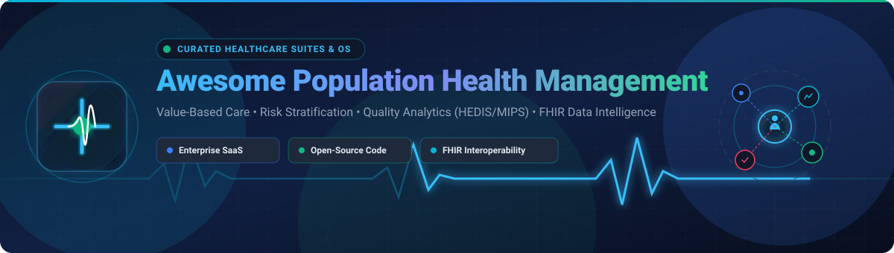

# 🏥 Awesome Population Health Management

> **Curated List of SaaS Platforms, Value-Based Care Suites & Open-Source GitHub Projects**  
> Focused on Population Health Analytics, Care Management, Risk Stratification, Quality Measurement, Care Gaps, FHIR Interoperability & Clinical Data Intelligence.  
> *Last updated: September 2026*

---

## 📌 Table of Contents

- [💡 Overview](#-overview)
- [🏢 SaaS & Commercial Hosted Platforms](#-saas--commercial-hosted-platforms)
- [🔓 Open-Source GitHub Projects](#-open-source-github-projects)
- [🛠 Open-Source Architecture Foundations](#-open-source-architecture-foundations)
- [🤝 How to Contribute](#-how-to-contribute)
- [📈 Star History](#-star-history)
- [⚖️ Disclaimer](#️-disclaimer)

---

## 💡 Overview

Population Health Management (PHM) platforms help healthcare organizations aggregate clinical, claims, pharmacy, laboratory, social determinants of health (SDOH), and patient-generated data. By processing longitudinal records, these tools enable health systems, Accountable Care Organizations (ACOs), and payers to identify high-risk populations, stratify patients, close care gaps, coordinate multidisciplinary care, measure quality metrics (HEDIS, MIPS), and improve clinical outcomes while managing financial risk.

---

## 🏢 SaaS & Commercial Hosted Platforms

> 📊 **Market Size & Market Structure**: The global Population Health Management (PHM) market is estimated at **~$46 Billion - $50 Billion in 2026** (projected to reach **$120+ Billion by 2030** at a 16–22% CAGR). The market structure is **moderately fragmented**, balancing dominant enterprise health system suites (Epic, Oracle, Cotiviti, Innovaccer) with specialized value-based care, risk-adjustment, and AI-driven niche software providers.

*Sorted by Company Size / Valuation (Descending)*

| 🏥 SaaS Platform | 🏢 Company Size (Revenue / Valuation) | 💼 Description | 💰 Starting Pricing | 🎁 Free Tier / Trial Limit |
| :--- | :--- | :--- | :--- | :--- |
| **Epic Healthy Planet** | `$15.0B+` Valuation ($6.7B/yr Revenue) | Enterprise population health management platform integrated with the Epic ecosystem for patient registries, risk stratification, care-gap management, and value-based care. | `$1,200/provider/month` (Garden Plot / Healthy Planet starting tier) | No free forever plan; Epic UserWeb sandbox demo environment for verified health systems |
| **Oracle Population Health** | `$28.2B` Acquisition ($5.9B/yr Revenue) | Oracle Health platform (Cerner HealtheIntent) for population health, value-based care, quality management, care coordination, longitudinal data intelligence, and AI-assisted prioritization. | `$1,000/month` (Cerner HealtheIntent platform starting tier) | No free forever plan; 30-day Oracle Cloud healthcare sandbox trial upon request |
| **Cotiviti** | `$11.0B` Valuation ($1.0B+/yr Revenue) | Healthcare analytics platform providing data-driven solutions for clinical quality, risk adjustment, payment integrity, and population health programs. | `$1,000/month` (quality & risk starter module) | No free forever plan; guided product demo environment upon request |
| **Innovaccer** | `$3.45B` Valuation ($100M+/yr Revenue) | Healthcare intelligence and data-activation platform focused on unifying healthcare data, population health, care management, value-based care, and AI workflows. | `$250/month` (starter tier estimate) | No free forever plan; 14-day interactive demo & sandbox trial upon request |
| **Innovaccer Atlas** | `$3.45B` Valuation (Innovaccer Suite) | Population Health Operating System designed to connect healthcare data, intelligence, and care delivery across patient populations, settings, and payment models. | `$500/month` (starter platform tier) | No free forever plan; 14-day risk-free pilot sandbox upon request |
| **Innovaccer InCare** | `$3.45B` Valuation (Innovaccer Suite) | Automated care-management and patient-engagement platform within the broader Innovaccer healthcare intelligence ecosystem. | `$200/provider/month` (care management starting tier) | No free forever plan; 14-day live sandbox demo trial upon request |
| **Aledade** | `$3.10B` Valuation ($500M+/yr Revenue) | Value-based primary-care platform providing technology, analytics, care-management support, and population-health infrastructure for independent practices. | `$0/month base fee` (shared savings performance model: 5%–10% shared savings) | No standard free forever plan; 30-day practice assessment and onboarding trial |
| **eClinicalWorks healow** | `$3.00B` Valuation ($800M/yr Revenue) | Digital health and patient-engagement ecosystem supporting patient access, care coordination, telehealth, communication, and population-oriented healthcare workflows. | `$150/provider/month` (healow starter tier; $449/mo full EHR bundle) | No free forever plan; 14-day interactive software demo trial upon request |
| **Lumeris** | `$1.50B` Valuation ($600M+/yr Revenue) | Value-based care and population-health platform supporting care delivery transformation, analytics, population management, and risk-based payment models. | `$1,500/month` (value-based platform starting tier) | No free forever plan; custom executive demo sandbox upon request |
| **Veradigm** | `$1.20B` Valuation / Market Cap ($600M/yr Revenue) | Healthcare data and technology platform supporting population analytics, clinical data exchange, provider performance, and value-based care workflows. | `$299/provider/month` (clinical analytics starting tier) | No free forever plan; 14-day interactive demo trial upon request |
| **Clarify Health** | `$1.10B` Valuation ($75M/yr Revenue) | Enterprise healthcare analytics and intelligence platform focused on population analytics, provider performance, care variation, and value-based care decision support. | `$500/user/month` (starter tier for up to 5 users) | No free forever plan; 14-day sample dataset sandbox trial upon request |
| **Health Catalyst** | `$600M` Valuation / Market Cap ($300M/yr Revenue) | Healthcare data and analytics platform providing enterprise data warehousing, population analytics, quality improvement, care management, and performance intelligence. | `$1,000/month` (base platform tier) | No free forever plan; 30-day proof-of-concept sandbox trial upon request |
| **Arcadia** | `$500M` Valuation ($150M+/yr Revenue) | Healthcare data and analytics platform focused on population health, value-based care, clinical data aggregation, quality measurement, and provider performance. | `$500/user/month` (starting tier) | No free forever plan; 14-day custom sandbox trial upon request |
| **Cedar Gate Technologies** | `$500M` Valuation ($100M/yr Revenue) | Value-based care technology platform supporting population health, analytics, care management, financial management, and healthcare performance measurement. | `$750/month` (analytics starter suite) | No free forever plan; 14-day demo sandbox trial upon request |
| **ZeOmega** | `$300M` Valuation ($60M/yr Revenue) | Population health and care management platform built around the Jiva Healthcare Enterprise Management Platform for data integration, risk stratification, and quality programs. | `$1,000/month` (Jiva starting enterprise tier) | No free forever plan; 14-day enterprise demo sandbox upon request |
| **Lightbeam Health Solutions** | `$250M` Valuation ($50M/yr Revenue) | Population health management and value-based care platform supporting clinical data aggregation, patient risk identification, care coordination, and ACO operations. | `$600/month` (starter analytics tier) | No free forever plan; 14-day guided sandbox demo upon request |
| **ClosedLoop.ai** | `$200M` Valuation ($15M/yr Revenue) | Healthcare AI and predictive analytics platform focused on clinical risk prediction, population analytics, and proactive care management. | `$500/month` (predictive analytics starter tier) | No free forever plan; 30-day proof-of-concept AI sandbox trial upon request |
| **Azara DRVS** | `$150M` Valuation ($35M/yr Revenue) | Healthcare analytics and population health platform focused particularly on community health centers (FQHCs), quality reporting, patient registries, and population analytics. | `$100/month` (single-user starter tier) | No free forever plan; 14-day trial/demo sandbox upon request |
| **CareJourney** | `$150M` Valuation ($30M/yr Revenue) | Healthcare analytics platform focused on population intelligence, provider performance, network analysis, utilization, and value-based healthcare insights. | `$5,000/company/month` (AppExchange Provider Performance starting tier) | No free forever plan; 14-day sample dataset evaluation trial upon request |
| **CareCloud** | `$120M` Revenue / $50M Market Cap | Healthcare technology platform offering clinical, practice management, analytics, and population-oriented healthcare management capabilities. | `$349/provider/month` (CareCloud Central starting tier; $628/mo EHR bundle) | No free forever plan; 14-day free demo trial upon request |
| **Jvion** | `$100M` Valuation (Acquired by Lightbeam) | Healthcare AI and population-health technology ecosystem focused on clinical prescriptive analytics and patient risk identification. | `$99/user/month` (clinical predictive analytics starting tier) | No free forever plan; 14-day clinical trial sandbox demo upon request |
| **Persivia** | `$100M` Valuation ($25M/yr Revenue) | Healthcare data and care-management platform focused on population health, interoperability, analytics, risk stratification, and value-based care. | `$400/month` (Persivia CareSpace starting tier) | No free forever plan; 14-day live software demo trial upon request |

---

## 🔓 Open-Source GitHub Projects

The open-source ecosystem provides powerful building blocks for self-hosted clinical data platforms, cohort discovery engines, FHIR interoperability servers, OMOP analytics, and health information systems.

*Sorted by GitHub Star Count (Descending)*

| 🚀 Open-Source Repository | ⭐ Star Count | ⚡ Category & Utility Description |
| :--- | :--- | :--- |
| **[Elasticsearch](https://github.com/elastic/elasticsearch)** |  | **Data Storage & Search**: Distributed search and analytics engine widely used for longitudinal patient record indexing, clinical document search, and real-time analytical workloads. |
| **[Grafana](https://github.com/grafana/grafana)** |  | **Dashboards & Monitoring**: Multi-platform visualization tool for real-time population health metrics, pipeline telemetry, and operational clinical status dashboards. |
| **[Apache Superset](https://github.com/apache/superset)** |  | **Business Intelligence**: Modern enterprise data exploration and visualization platform for patient cohort reporting, quality metrics, and care gap analytics. |
| **[Apache Spark](https://github.com/apache/spark)** |  | **Big Data Engine**: Unified analytics engine for large-scale clinical data processing, claims transformation, risk stratification modeling, and population-scale ETL. |
| **[Metabase](https://github.com/metabase/metabase)** |  | **Analytics & Reporting**: Open-source business intelligence tool for querying clinical databases, patient registries, utilization statistics, and healthcare quality reporting. |
| **[ClickHouse](https://github.com/ClickHouse/ClickHouse)** |  | **Columnar DBMS**: Fast open-source column-oriented database management system for real-time analytical reporting on massive clinical event and claims streams. |
| **[Apache Airflow](https://github.com/apache/airflow)** |  | **Workflow Orchestration**: Orchestration platform to programmatically author, schedule, and monitor clinical data ingestion, claims pipelines, and cohort refreshes. |
| **[Apache Kafka](https://github.com/apache/kafka)** |  | **Event Streaming**: Distributed event-streaming platform for streaming real-time ADT feeds, laboratory results, FHIR resources, and clinical updates. |
| **[Airbyte](https://github.com/airbytehq/airbyte)** |  | **Data Integration**: Open-source ELT data integration platform for moving data between healthcare databases, clinical APIs, and analytical warehouses. |
| **[Prefect](https://github.com/PrefectHQ/prefect)** |  | **Workflow Automation**: Pythonic data workflow orchestration framework ideal for scheduled and event-driven healthcare data processing pipelines. |
| **[PostgreSQL](https://github.com/postgres/postgres)** |  | **Relational Database**: Powerful open-source SQL database serving as the foundational store for OMOP CDM, OpenMRS, HAPI FHIR, and patient registry platforms. |
| **[Dagster](https://github.com/dagster-io/dagster)** |  | **Data Orchestration**: Cloud-native data orchestrator for healthcare machine learning pipelines, clinical data asset tracking, and data quality validation. |
| **[dbt Core](https://github.com/dbt-labs/dbt-core)** |  | **Analytics Engineering**: Analytics engineering framework for transforming raw healthcare claims and clinical data into standardized population health models. |
| **[Apache NiFi](https://github.com/apache/nifi)** |  | **Data Routing & Flow**: Robust data logistics platform designed to automate the flow of data between EHRs, FHIR servers, HL7 feeds, and analytics engines. |
| **[Synthea Synthetic Patient Generator](https://github.com/synthetichealth/synthea)** |  | **Synthetic Medical Data**: Open-source synthetic patient generator simulating realistic medical histories, conditions, and treatments in FHIR & C-CDA formats. |
| **[Medplum](https://github.com/medplum/medplum)** |  | **FHIR Developer Platform**: Headless FHIR-native developer platform providing clinical APIs, React component libraries, automation workflows, and auth. |
| **[HAPI FHIR](https://github.com/hapifhir/hapi-fhir)** |  | **HL7 FHIR Engine**: Standard-setting Java implementation of the HL7 FHIR specification for interoperable healthcare APIs and server infrastructure. |
| **[OpenEMR](https://github.com/openemr/openemr)** |  | **Open-Source EHR**: ONC-certified electronic health record and practice management software with built-in FHIR REST API and clinical reporting modules. |
| **[Microsoft FHIR Server](https://github.com/microsoft/fhir-server)** |  | **Enterprise FHIR Server**: Enterprise-grade open-source implementation of HL7 FHIR standard for cloud environments with SQL/Cosmos DB backends. |
| **[cBioPortal](https://github.com/cBioPortal/cbioportal)** |  | **Genomic & Clinical Data**: Open-source platform for interactive exploration of multidimensional cancer genomics and precision clinical population data. |
| **[OpenMRS Core](https://github.com/openmrs/openmrs-core)** |  | **Clinical Records Platform**: Extensible enterprise electronic medical record platform serving as a foundation for global health registries and longitudinal care. |
| **[Google FHIR Protocol Buffers](https://github.com/google/fhir)** |  | **FHIR Utilities**: Google open-source library for parsing, manipulating, and validating FHIR resources using protocol buffers for high-speed processing. |
| **[DHIS2 Core](https://github.com/dhis2/dhis2-core)** |  | **Public Health HMIS**: Premier open-source health information management system used for national disease surveillance, tracking, and population analytics. |
| **[SORMAS Project](https://github.com/SORMAS-Foundation/SORMAS-Project)** |  | **Disease Surveillance**: Open-source surveillance and outbreak management platform for public health monitoring, case management, and contact tracing. |
| **[CommCare HQ](https://github.com/dimagi/commcare-hq)** |  | **Community Health Platform**: Open-source digital health platform supporting frontline healthcare worker workflows, longitudinal tracking, and field data. |
| **[OHDSI ATLAS](https://github.com/OHDSI/Atlas)** |  | **Cohort Analytics & Discovery**: Web-based analytical tool supporting cohort definition, concept set construction, incidence rate analysis, and population research. |
| **[OMOP Common Data Model](https://github.com/OHDSI/CommonDataModel)** |  | **Common Data Model Schema**: Standardized relational schema unifying observational clinical, claims, pharmacy, and vocabulary datasets globally. |
| **[GNU Health](https://github.com/gnuhealth/hospital)** |  | **Hospital Information System**: Libre health and hospital information system supporting electronic medical records, laboratory management, and epidemiology. |
| **[Bahmni](https://github.com/Bahmni/openmrs-module-bahmniapps)** |  | **Integrated Hospital EMR**: Open-source hospital system combining OpenMRS, dcm4chee, OpenELIS, and Odoo for clinical care and hospital management. |
| **[OHDSI WebAPI](https://github.com/OHDSI/WebAPI)** |  | **Observational Data Middleware**: RESTful backend services engine powering OHDSI ATLAS for cohort generation, vocabulary search, and analytics execution. |
| **[OHDSI HADES](https://github.com/OHDSI/Hades)** |  | **Population Analytics R Suite**: Set of open-source R packages for large-scale observational research, patient-level prediction, and comparative cohort analysis. |
| **[CQF Ruler](https://github.com/cqframework/cqf-ruler)** |  | **Clinical Decision Engine**: FHIR-based decision support engine executing Clinical Quality Language (CQL) rules, quality measures, and care-gap logic. |

---

## 🛠 Open-Source Architecture Foundations

Building a complete, self-hosted enterprise Population Health Management platform generally involves assembling a composable tech stack:

1. **Clinical Data & EMR Foundation**: [OpenMRS](https://github.com/openmrs/openmrs-core), [OpenEMR](https://github.com/openemr/openemr), or [GNU Health](https://github.com/gnuhealth/hospital).
2. **Interoperability & FHIR API Server**: [HAPI FHIR](https://github.com/hapifhir/hapi-fhir), [Medplum](https://github.com/medplum/medplum), or [Microsoft FHIR Server](https://github.com/microsoft/fhir-server).
3. **Observational Analytics & Cohort Discovery**: Standardize datasets to the [OMOP Common Data Model](https://github.com/OHDSI/CommonDataModel) and execute cohort analytics via [OHDSI ATLAS](https://github.com/OHDSI/Atlas) & [HADES](https://github.com/OHDSI/Hades).
4. **Data Pipelines & Ingestion**: Schedule ETL workflows using [Apache Airflow](https://github.com/apache/airflow), [Prefect](https://github.com/PrefectHQ/prefect), [Dagster](https://github.com/dagster-io/dagster), or stream real-time events via [Apache Kafka](https://github.com/apache/kafka) & [Apache NiFi](https://github.com/apache/nifi).
5. **Analytical Storage & Visualization**: Store analytical data in [ClickHouse](https://github.com/ClickHouse/ClickHouse) or [PostgreSQL](https://github.com/postgres/postgres), and build population health dashboards using [Apache Superset](https://github.com/apache/superset), [Metabase](https://github.com/metabase/metabase), or [Grafana](https://github.com/grafana/grafana).
6. **Clinical Quality & Care Gaps**: Implement decision support rules using [CQF Ruler](https://github.com/cqframework/cqf-ruler) and Clinical Quality Language (CQL).

---

## 🤝 How to Contribute

Contributions are warmly welcomed! Please read these quick guidelines:

1. **Fork the Repository**: Click the Fork button at the top right of this repository.
2. **Add/Update Entries**: Add factual product details to `README.md`.
3. **Entry Format**: Include the product/repo name, official website/GitHub link, 1–2 sentence description, exact pricing/star details, and category classification.
4. **Submit a Pull Request**: Open a PR with a clear summary of your additions.

Reference catalog of curated awesome lists: [Awesome-Awesome-Awesome](https://github.com/ishandutta2007/Awesome-Awesome-Awesome).

---

## 📈 Star History

---

## ⚖️ Disclaimer

*This list is community-curated for informational, research, and educational purposes—it does not constitute financial, legal, medical, or clinical advice or vendor endorsement.*

- **Privacy & Security**: Population Health Management platforms process protected health information (PHI) and must comply with HIPAA, GDPR, SOC 2, and relevant national health data security laws.
- **Clinical Validation**: Predictive risk models, AI triage scores, and care-gap algorithms require proper clinical governance and validation by qualified healthcare professionals.
- **Market Data**: Pricing estimates, valuations, and star counts reflect publicly reported research and open market data as of 2026 and are subject to change.

---

  Made with ❤️ for healthcare providers, accountable care organizations, clinical informaticists, payers, public health agencies, and open-source health technologists.

